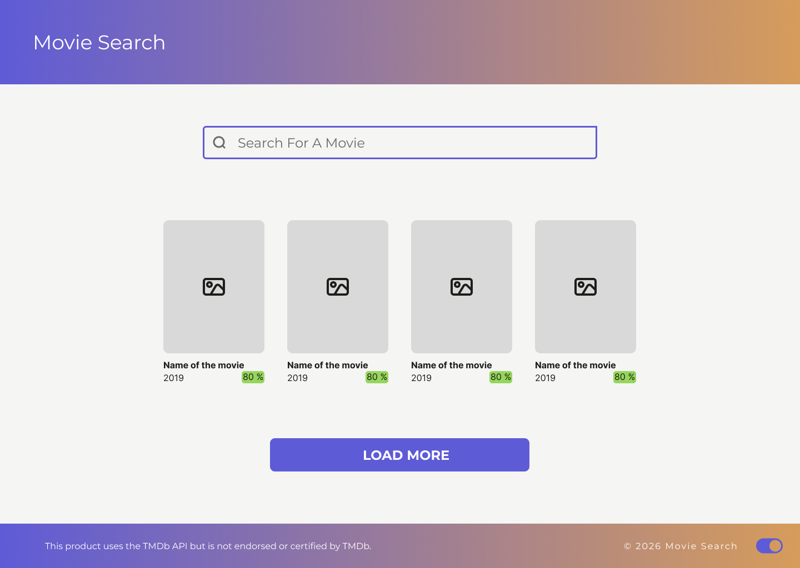

# Movie Search App

A movie search application built with **React** and **TypeScript** using the **TMDB API**.

This project focuses on working with an external API, structuring a React application, and handling typed data using TypeScript.


> **Currently in progress – actively extending features and improving UX.**

---

## Design Preview (Figma)

<p align="center">
  
</p>

---

## Live Demo

The project is deployed on Netlify:

[Live Demo](https://moviesearchproject.netlify.app/)

---

## Features

- Integration with TheMovieDB API
- Fetching and displaying movie data from TheMovieDB API (currently using a predefined query)
- Rendering movie data in a structured list view
- Basic routing structure (Search view and Movie Detail view)
- Global state management using React Context
- Component-based architecture with reusable UI components
- Styling with styled-components and custom theme configuration


---

## Planned Improvements

- Implement dynamic search connected to user input
- Implement pagination logic for the "Load More" button
- Complete Movie Detail page with detailed movie information
- Add loading and error states for better UX
- Final accessibility audit and refinements
- Refine UI and responsive behavior


---


## Tech Stack

- React
- TypeScript
- React Router
- styled-components
- TMDB API
- Context API
- Vite

---

## Getting Started (Local Development)

```bash
git clone https://github.com/Nekvaja/movie-search-app.git
cd movie-search-app
npm install
npm run dev
```

### Set up environment variables

To run this project locally, you need your own access token from TheMovieDB.

1. Create a free account at https://www.themoviedb.org
2. Generate a Token
3. Create a `.env` file in the root directory:

```
VITE_TMDB_TOKEN=your_token_here
```
